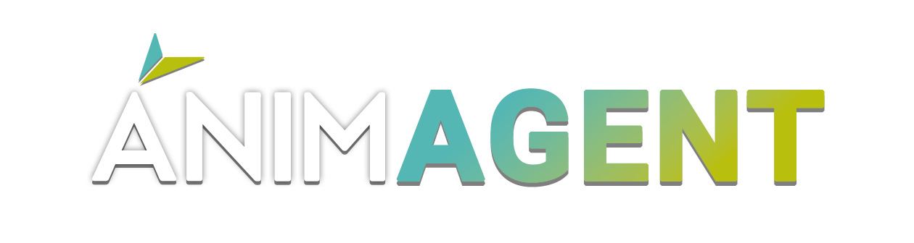
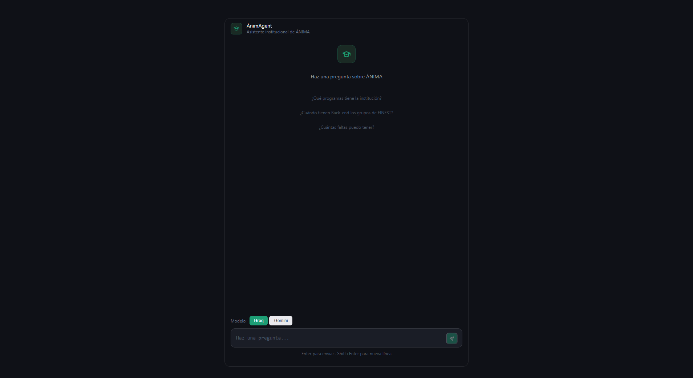
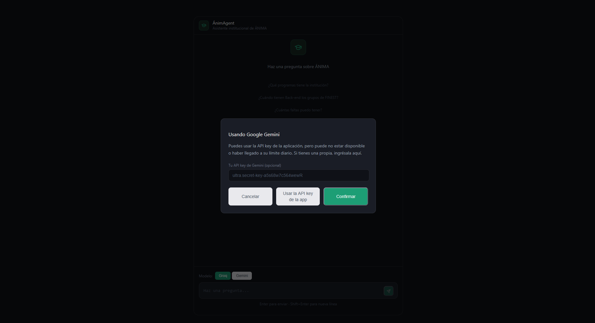
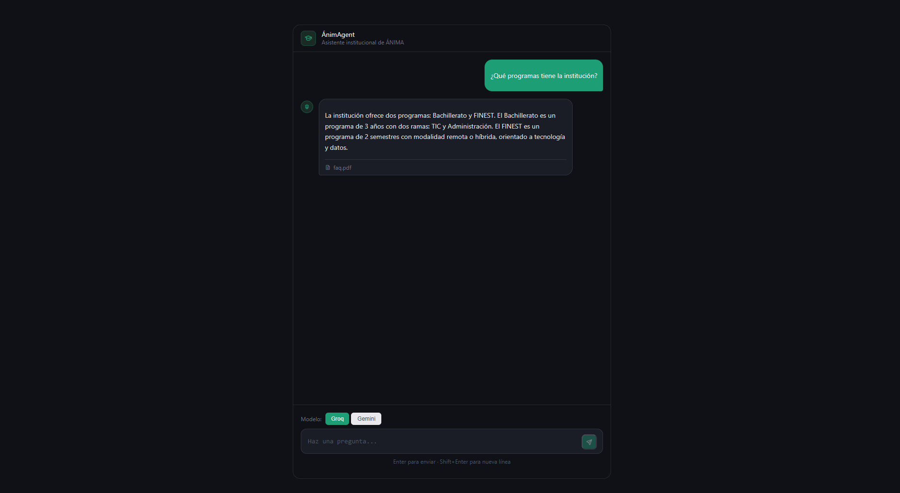
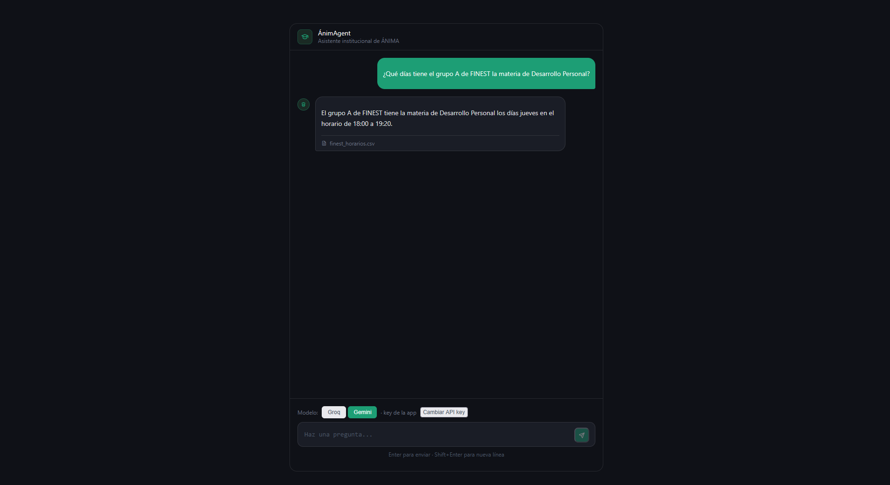
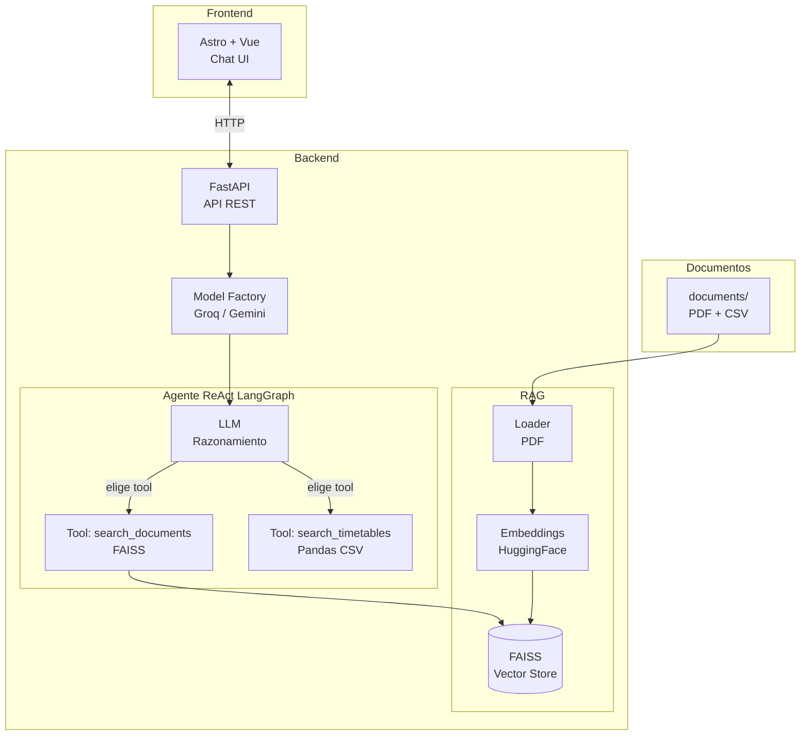

<!-- Logo y badges -->
<p align="center">
    
</p>

<h3 align="center">Un chatbot IA de conocimiento institucional</h3>

<div align="center">
    
    
    
</div>

<!-- Visión general -->
## 📖︲Descripción

ÁnimAgent es un agente de inteligencia artificial diseñado para responder preguntas sobre la documentación de un instituto. A partir de documentos reales como reglamentos, horarios, políticas de becas y preguntas frecuentes, el agente recupera información relevante y genera respuestas claras y confiables, sin alucinar datos que no estén en la fuente.

Desarrollado como proyecto de la segunda etapa Oracle ONE 2026, ÁnimAgent combina técnicas modernas de RAG (Generación Aumentada por Recuperación) con un agente inteligente basado en LangGraph, capaz de decidir qué herramienta usar para recuperar la información más relevante antes de responder.

<!-- Características principales -->
## 💫︲Características principales

- **RAG (Generación Aumentada por Recuperación):** las respuestas se generan a partir de fragmentos reales de la documentación institucional, no de conocimiento genérico del modelo.
- **Agente ReAct con herramientas:** basado en LangGraph, el agente razona sobre cada pregunta y decide qué herramienta invocar: búsqueda semántica en documentos PDF o búsqueda estructurada en horarios CSV.
- **Fragmentación semántica de documentos:** los documentos se dividen en chunks con superposición para preservar el contexto entre fragmentos.
- **Embeddings con HuggingFace:** generación de representaciones vectoriales de los textos usando modelos de embeddings de HuggingFace.
- **Base de datos vectorial FAISS:** almacenamiento y búsqueda eficiente de embeddings para recuperación de fragmentos relevantes.
- **Integración con múltiples LLMs:** soporte para Google Gemini (con API key propia del usuario) y Groq como alternativa gratuita.
- **Citación de fuentes:** el agente indica de qué documento proviene la información utilizada para generar la respuesta.
- **Interfaz de chat moderna:** frontend construido con Astro y Vue, accesible desde el navegador.
- **Desplegado en Oracle Cloud Infrastructure:** la aplicación corre en OCI Compute y es accesible públicamente.
- **Arquitectura preparada para Docker:** contenedorización del backend para facilitar el despliegue y la portabilidad.
- **API key configurable por el usuario:** el usuario puede ingresar su propia API key de Google Gemini desde la interfaz; de lo contrario, el sistema utiliza Groq automáticamente.

<!-- Capturas de la interfaz y funcionamiento -->
## 🖼️︲Capturas

A continuación, varias capturas de pantalla de la interfaz y el agente en acción.

### Interfaz



### Modal de cambio de proveedor a Gemini

_Este modal aparece una vez cuando eliges cambiar a Gemini, y después cuando presionas el botón de cambiar API key_



### Pregunta sobre documentación (PDF)



### Pregunta sobre horarios (CSV)



### Preguntas irrelevantes o sin datos existentes


<!-- Arquitectura del sistema -->
## ⚙️︲Arquitectura y flujo

### Arquitectura del sistema

ÁnimAgent está compuesto por tres capas principales: el frontend de chat, el backend con FastAPI y un agente ReAct basado en LangGraph con RAG.



### Flujo de una consulta

1. El usuario escribe una pregunta en el chat
2. El frontend envía un `POST /api/chat` con la query, el provider elegido y opcionalmente una API key de Gemini en el header
3. FastAPI instancia el modelo correspondiente (Gemini o Groq) y construye el agente
4. El agente ReAct analiza la pregunta y decide qué herramienta usar: `search_documents` para PDFs o `search_timetables` para horarios
5. La herramienta recupera la información relevante y se la devuelve al agente
6. El agente evalúa si tiene suficiente información para responder o si necesita llamar otra herramienta
7. Una vez satisfecho, genera la respuesta final y la devuelve al frontend

### Componentes del agente

- `tools.py` — define las dos herramientas del agente: búsqueda semántica en documentos (FAISS) y búsqueda estructurada en horarios (Pandas)
- `graph.py` — construye el agente ReAct con `create_react_agent` de LangGraph
- `factory.py` — instancia Gemini o Groq según el provider elegido
- `rag/` — carga documentos, genera embeddings y gestiona el índice FAISS

<!-- Estructura del Proyecto -->
## 📂︲Estructura del proyecto

```text
animagent/
│
├── assets/                     # Imágenes, logo y archivos estáticos del proyecto
│
├── documents/                  # Documentación de la institución, con subcarpetas por categoría y archivos PDF/CSV
│
├── backend/
│   ├── agent/
│   │   ├── graph.py            # StateGraph de LangGraph (nodos y conexiones)
│   │   └── tools.py            # Definición de herramientas del agente (buscar en PDF y CSV)
│   │
│   ├── rag/
│   │   ├── loader.py           # Carga y parseo de PDFs y CSVs
│   │   ├── embeddings.py       # Generación de embeddings e índice FAISS
│   │   └── retriever.py        # Búsqueda de fragmentos relevantes
│   │
│   ├── models/
│   │   └── factory.py          # Instancia Gemini o Groq según disponibilidad
│   │
│   ├── api/
│   │   └── routes.py           # Endpoints FastAPI
│   │
│   ├── tests/
│   │   ├── integration         # Test de integración (flujo de agente completo)
│   │   └── unit                # Tests unitarios (configuración, loader, retriever, router)
│   │
│   ├── .env.example
│   ├── config.py               # Variables de entorno y configuración global
│   ├── main.py                 # Punto de entrada del servidor
│   ├── Dockerfile              # Configuración docker backend
│   └── requirements.txt
│
├── frontend/
│   ├── src/
│   │   ├── components/
│   │   │   ├── Chat.vue        # Combina ChatWindow y ChatInput
│   │   │   ├── ChatWindow.vue  # Ventana de mensajes
│   │   │   ├── ChatInput.vue   # Input del usuario
│   │   │   └── ApiKeyModal.vue # Modal para ingresar API key de Gemini propia
│   │   ├── pages/
│   │   │   └── index.astro     # Página principal
│   │   └── services/
│   │       └── api.ts          # Llamadas al backend
│   ├── astro.config.mjs
│   ├── .env.example
│   ├── Dockerfile              # Configuración docker frontend
│   └── package.json
│
├── .gitignore
├── docker-compose.yml
├── LICENSE
└── README.md
```

<!-- Instalación del Proyecto -->
## 🚀︲Instalación y uso

### Requisitos previos

- Python 3.11+
- Node.js 18+
- Git

### 1. Clonar el repositorio

```bash
git clone https://github.com/tu-usuario/animagent.git
cd animagent
```

### 2. Configurar el backend

```bash
cd backend
python -m venv .venv
```

#### Windows

```bash
.venv\Scripts\activate
```

#### MacOS

```bash
source .venv/bin/activate
```

### 3. Instalar dependencias

```bash
pip install -r requirements.txt
```

### 4. Configurar variables de entorno

```bash
cp ./.env.example ./.env
```

Recuerda **editar el .env con tus API keys y parámetros**.

### 5. Correr el servidor

```bash
python main.py
```

<!-- Docker -->
## 🐳︲Docker

### Requisitos previos

- Docker
- Docker Compose

### 1. Configurar variables de entorno

```bash
cp .env.example.env
```

Edita el `.env` con tus API keys. Para producción, cambia también `HOST` a `0.0.0.0` y `FRONTEND_URL` a la URL pública del servidor.

### 2. Armar y levantar los contenedores

```bash
docker compose up --build
```

El backend estará disponible en `http://localhost:8000` y el frontend en `http://localhost:4321`.

### 3. Detener los contenedores

```bash
docker compose down
```

<!-- Tests -->
## 🧪︲Tests

Los tests están organizados en dos categorías: unitarios e integración.
Requieren tener el `.env` configurado con al menos una API key válida.

```bash
cd backend
python -m pytest tests/ -v
```

### Solo unitarios

```bash
python -m pytest tests/unit/ -v
```

### Solo integración

```bash
python -m pytest tests/integration/ -v
```

<!-- Tecnologías usadas -->
## ☕︲Tech Stack

### Lenguajes

- Python 3.11+
- TypeScript

### IA / LLM

- [LangChain](https://www.langchain.com/) — orquestación de cadenas y herramientas
- [LangGraph](https://langchain-ai.github.io/langgraph/) — agente con flujo basado en grafos de estado
- [Google Gemini](https://deepmind.google/technologies/gemini/) — modelo de lenguaje principal (con API key del usuario)
- [Groq](https://groq.com/) — modelo de lenguaje alternativo gratuito

### Recuperación de datos

- [FAISS](https://faiss.ai/) — base de datos vectorial para búsqueda semántica
- [HuggingFace Embeddings](https://huggingface.co/) — generación de representaciones vectoriales

### Procesamiento de documentos

- [PyPDF](https://pypdf.readthedocs.io/) — lectura y extracción de texto de PDFs
- [Pandas](https://pandas.pydata.org/) — procesamiento de archivos CSV

### Interfaz de usuario

- [Astro](https://astro.build/) — framework web para el frontend
- [Vue 3](https://vuejs.org/) — componentes interactivos del chat
- [FastAPI](https://fastapi.tiangolo.com/) — API REST del backend

### Cloud

- [Oracle Cloud Infrastructure (OCI)](https://www.oracle.com/cloud/) — hosting del agente en OCI Compute

### DevOps

- [Docker](https://www.docker.com/) — contenedorización del backend
- [Git](https://git-scm.com/) / [GitHub](https://github.com/) — control de versiones

<!-- Roadmap -->
## 🛤️︲Roadmap

### ✅｜Versión 1.0

- Agente RAG funcional con LangGraph y routing por tipo de documento
- Indexación de todos los documentos institucionales (PDFs y CSVs)
- Backend con FastAPI
- Frontend de chat con Astro y Vue
- Soporte para Google Gemini y Groq
- API key configurable desde la interfaz por el usuario
- Citación de la fuente utilizada en cada respuesta
- Deploy en OCI Compute
- Arquitectura contenedorizada con Docker
- README con descripción, arquitectura y ejemplos de uso
- Tests automatizados del agente y del backend

### ⌛｜Versión 1.1

- Historial de conversación por sesión (memoria de contexto)
- Indicador visual de qué documento consultó el agente en cada respuesta
- Mejoras de UI: animaciones, estados de carga, manejo de errores visible
- Soporte para modelos adicionales (OpenAI, Cohere)

### 🚧｜Versión 1.2

- Carga de documentos nuevos sin necesidad de reiniciar el servidor (hot reload del índice)
- Sistema de feedback por respuesta (pulgar arriba / abajo)
- Logging de consultas para análisis de uso

### 🚧｜Versión 2.0

- Soporte multiidioma (español e inglés)
- Panel de administración para cargar y gestionar documentos desde la interfaz
- Autenticación de usuarios (estudiantes vs. administrativos)
- Respuestas diferenciadas según el perfil del usuario autenticado
